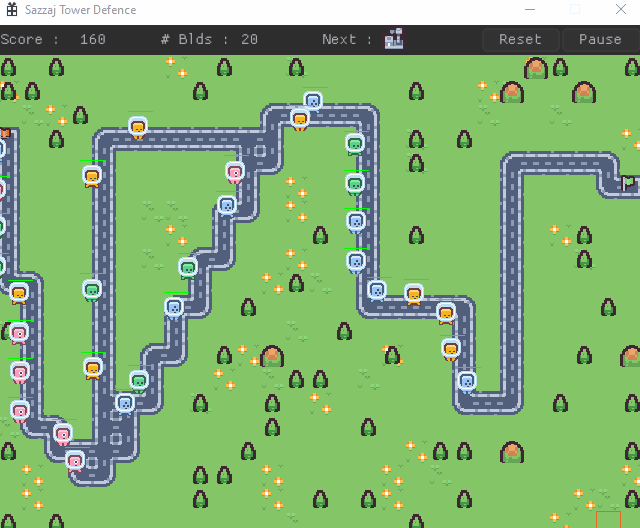
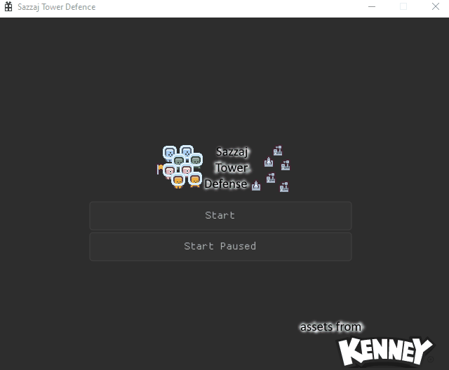
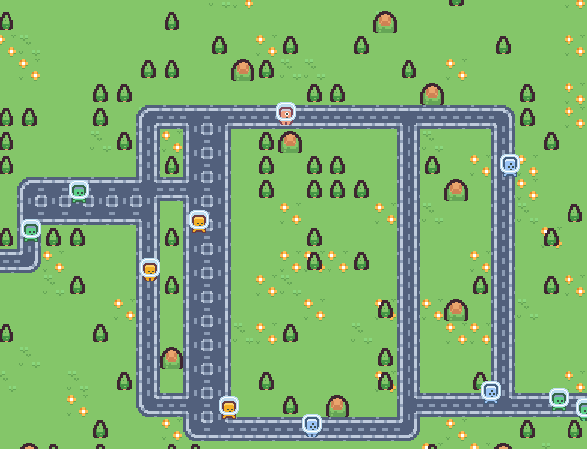
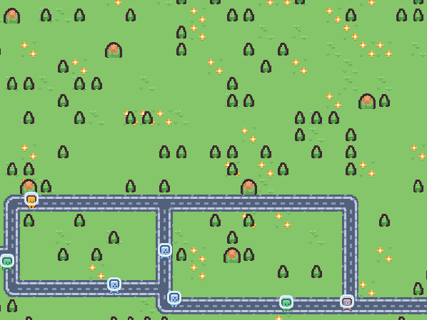

# Sazzaj Tower Defense 

Playground for various experiments disguised as a infinite procedural Tower Defense game.

Current experiments:
* pathfinding using BFS and A* algos
* tower defence map generation using a single entry and a single exit points with various intersections/junctions -> generates two pngs one for show and one for procedurally determining walkable areas.
* generate pathfinding grid from map generation
* simple AI unit spawner, AI goes from entry point to exit point
* two building types (slow and damage) placed by user
* limited number of buildings
* reset/pause options

# How it looks so far

### Newest

### Older

# License

Free to use and modify as you please for all types of projects. No acknowledgment is required.

# Third-party code

This software uses the following libraries and code:
* Nuklear Immediat Mode UI - https://immediate-mode-ui.github.io/Nuklear
* SDL - https://www.libsdl.org/
* SDL Image - https://github.com/libsdl-org/SDL_image

# Assets

free assets from https://www.kenney.nl/ 

